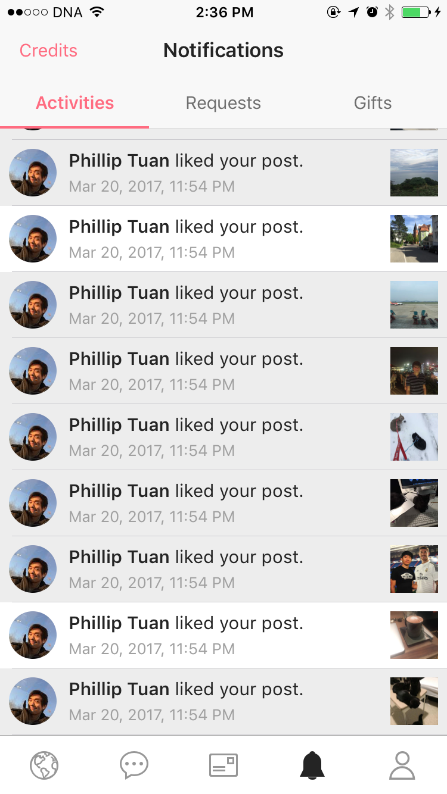

# DTPagerController

[](https://travis-ci.org/tungvoduc/DTPagerController)
[](http://cocoapods.org/pods/DTPagerController)
[](http://cocoapods.org/pods/DTPagerController)
[](http://cocoapods.org/pods/DTPagerController)

This is a control for iOS written in Swift. DTPagerController is simple to use and easy to customize. 

## Screenshot


## Usage

DTPagerController is extremely easy to use. In order to display two view controllers inside a pager controller. All you have to do is this many lines of code.

```swift
let viewController1 = ViewController()
let viewController2 = ViewController()
let pagerController = DTPagerController(viewControllers: [viewController1, viewController2])
```

DTPagerController is also customizable in case you want to implement your own UI.

```swift

// Change the height of segmented control
pagerController.preferredSegmentedControlHeight = 60

// Change normal font of each segmented control
pagerController.font = UIFont.customFont(ofSize: 15)

// Change selected font of each segmented control
pagerController.selectedFont = UIFont.boldCustomFont(ofSize: 15)

// Change normal text color of each segmented control
pagerController.textColor = UIColor.black

// Change selected text color of each segmented control
pagerController.selectedTextColor = UIColor.red

// Change scroll indicator height
pagerController.perferredScrollIndicatorHeight = 3

```

## Example

To run the example project, clone the repo, and run `pod install` from the Example directory first.

## Requirements
### iOS 9+

## Installation

DTPagerController is available through [CocoaPods](http://cocoapods.org). To install
it, simply add the following line to your Podfile:

```ruby
pod 'DTPagerController'
```

## Author

tungvoduc, tung98.dn@gmail.com

## License

DTPagerController is available under the MIT license. See the LICENSE file for more info.
