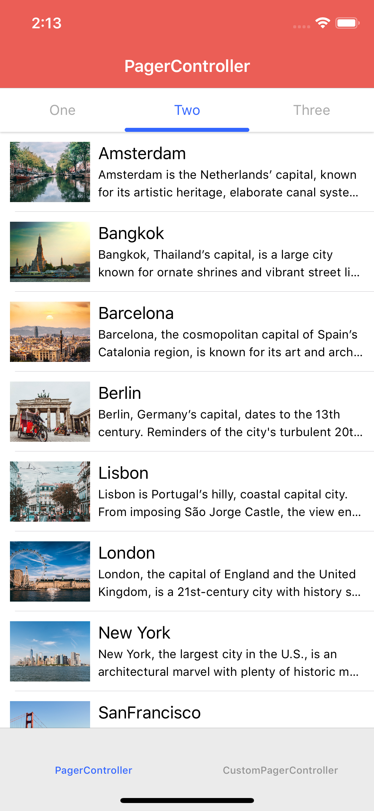
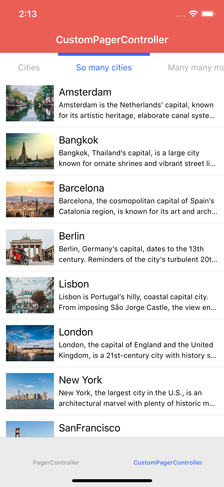

# DTPagerController

[](http://cocoapods.org/pods/DTPagerController)
[](http://cocoapods.org/pods/DTPagerController)
[](http://cocoapods.org/pods/DTPagerController)

This is a control for iOS written in Swift. DTPagerController is simple to use and easy to customize. 

## Screenshots

**Default segmented control**

<p align="left" >
  
</p> 


**Custom segmented control**
<p align="left" >
  
</p> 

## Usage

DTPagerController is extremely easy to use. In order to display two view controllers inside a pager controller. All you have to do is this many lines of code.

```swift
let viewController1 = ViewController()
let viewController2 = ViewController()
let pagerController = DTPagerController(viewControllers: [viewController1, viewController2])
```
### Update page index
There are 3 different ways to update selected page index programmatically.

```swift

// Update selected page index with animation
pagerController.selectedPageIndex = 1

// Update selected page index with animation
pagerController.setSelectedPageIndex(1, animated: true)

// Update selected page index without animation
pagerController.setSelectedPageIndex(1, animated: false)

```

### Custom UI
DTPagerController is also customizable in case you want to implement your own UI.

```swift

// Change the height of segmented control
pagerController.preferredSegmentedControlHeight = 60

// Change normal font of each segmented control
pagerController.font = UIFont.customFont(ofSize: 15)

// Change selected font of each segmented control
pagerController.selectedFont = UIFont.boldCustomFont(ofSize: 15)

// Change normal text color of each segmented control
pagerController.textColor = UIColor.black

// Change selected text color of each segmented control
pagerController.selectedTextColor = UIColor.red

// Change scroll indicator height
pagerController.perferredScrollIndicatorHeight = 3

```

### Custom segmented control
From version **2.0.0**, DTPagerController supports custom segmented control. Therefore, instead of using default **DTSegmentedControl**, you can provide your own segmented control or any 3rd-party segmented control libraries available out there. All you have to do is making your custom UIControl conform **DTSegmentedControlProtocol**. For example, as shown in sample project, **HMSegmentedControl** is made to conform **DTSegmentedControlProtocol** by using extension:

```swift

extension HMSegmentedControl: DTSegmentedControlProtocol {
    
    public func setImage(_ image: UIImage?, forSegmentAt segment: Int) {
        // Custom page control does not support
    }
    
    public func setTitle(_ title: String?, forSegmentAt segment: Int) {
        // Custom page control does not support
    }
    
    public func setTitleTextAttributes(_ attributes: [AnyHashable : Any]?, for state: UIControlState) {
        if state == UIControlState.normal {
            titleTextAttributes = attributes
        }
        else if state == UIControlState.selected {
            selectedTitleTextAttributes = attributes
        }
    }
    
}

```

Then we create new pager controller with the custom segmented control:

```swift

init(viewControllers controllers: [UIViewController]) {
        let segmentedControl = HMSegmentedControl(sectionTitles: ["Page 1", "Page 2", "Page 3"])
        super.init(viewControllers: controllers, pageSegmentedControl: segmentedControl!)
}

```

When using custom segmented control, it is recommneded to override/take a look at the following methods to customize behavior and appearance of each segments:

```swift

// Setup custom segmented control
func setUpSegmentedControl(viewControllers: [UIViewController])

// Update a custom appearance for segment
func updateAppearanceForSegmentedItem(at index: Int)

// Update a custom scroll indicator if exists
func updateScrollIndicator(with offsetRatio: CGFloat, scrollView: UIScrollView)

// Setup custom scroll indicator
func setUpScrollIndicator()

// Manually update segment title
func setTitle(_ title: String?, forSegmentAt segment: Int)
    
// Manually update segment image
func setImage(_ image: UIImage?, forSegmentAt segment: Int)

```

## Example

To run the example project, clone the repo, and run `pod install` from the Example directory first.

## Requirements
### iOS 9.0+

## Installation
### CocoaPods
Simply add the following line to your Podfile:


For Swift 5:

```ruby
pod 'DTPagerController'
```


For Swift 4.2:

```ruby
pod 'DTPagerController', '~> 2.0.4'
```

### Swift package manager
`DTPagerController` is available for SPM from version `3.0.2`.
Add the following to the dependencies of your `Package.swift`:

```swift
.package(url: "https://github.com/tungvoduc/DTPagerController", from: "version")
```

## Author

Tung Vo, tung98.dn@gmail.com

## License

DTPagerController is available under the MIT license. See the LICENSE file for more info.

## Feedbacks & requests
- Open an issue if you find a bug, make a proposal or simply need some help.
- You can also contact me via [email](mailto:tung98.dn@gmail.com).